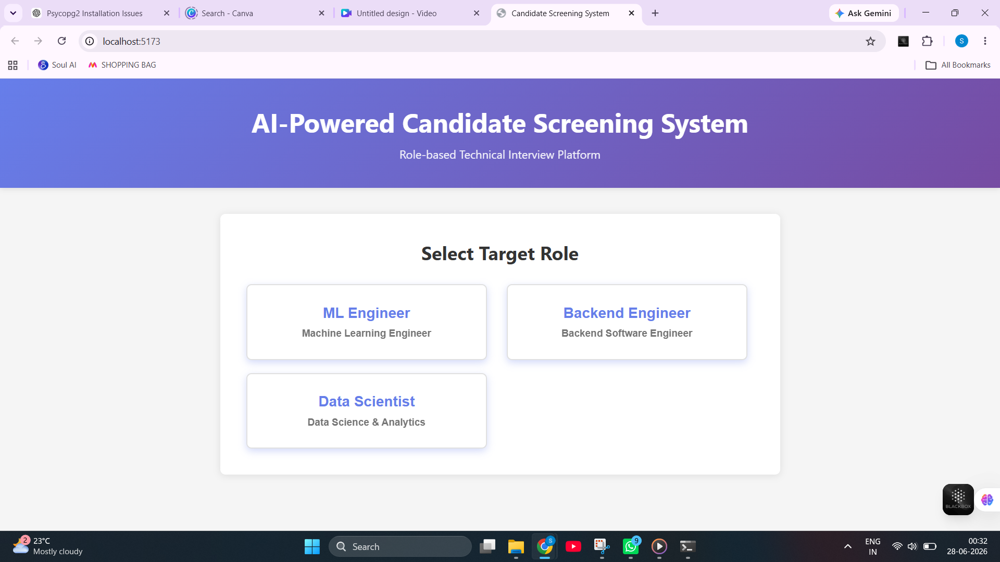
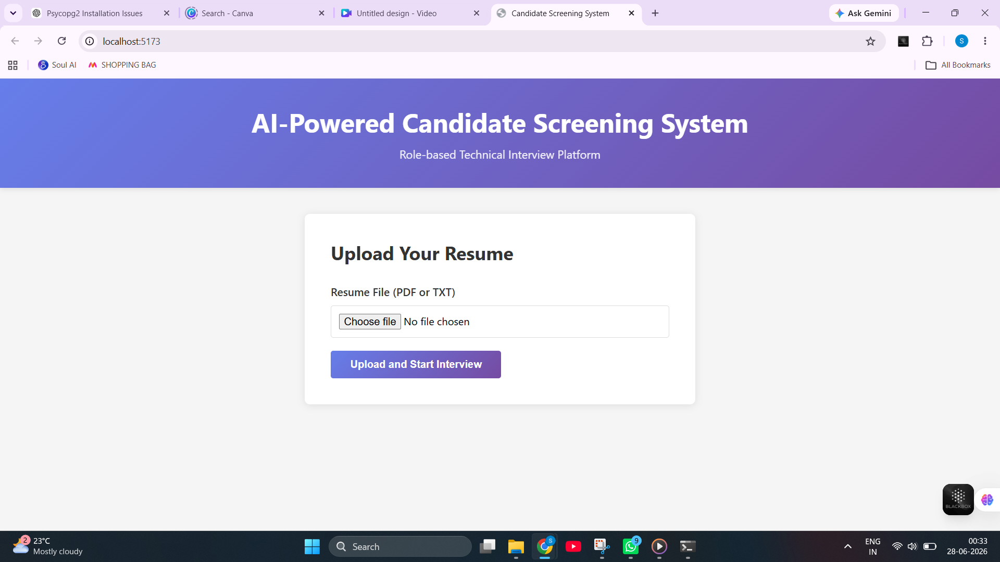
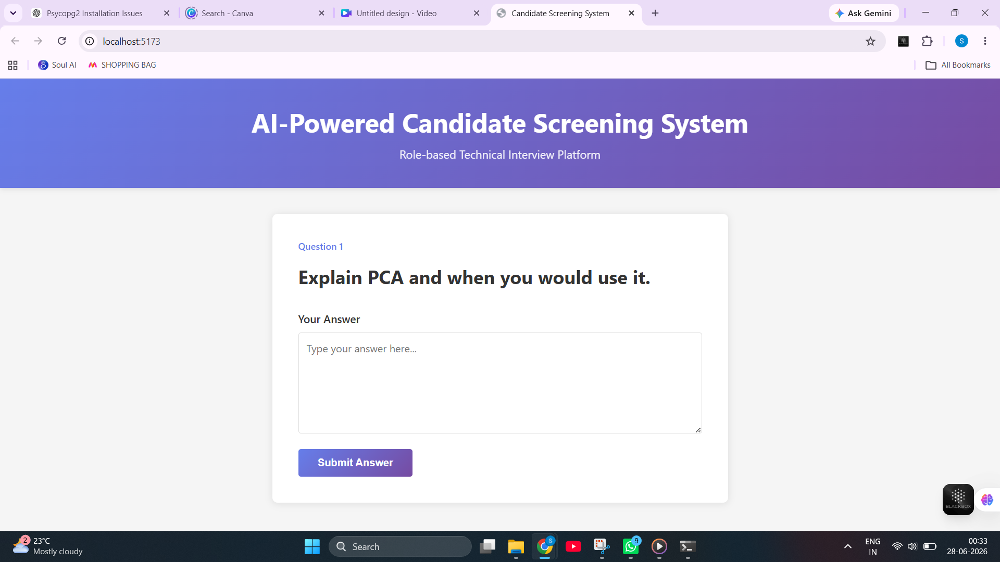
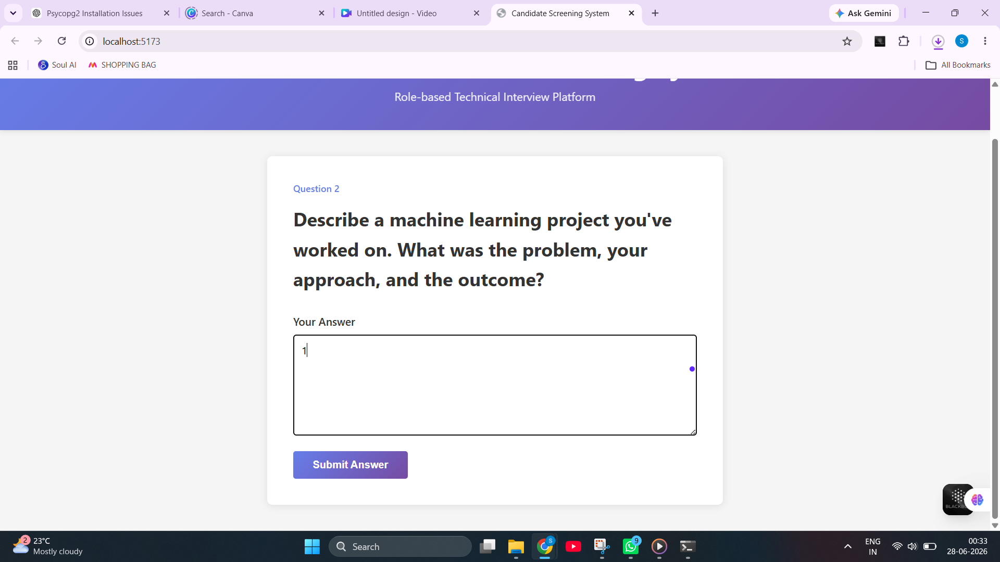
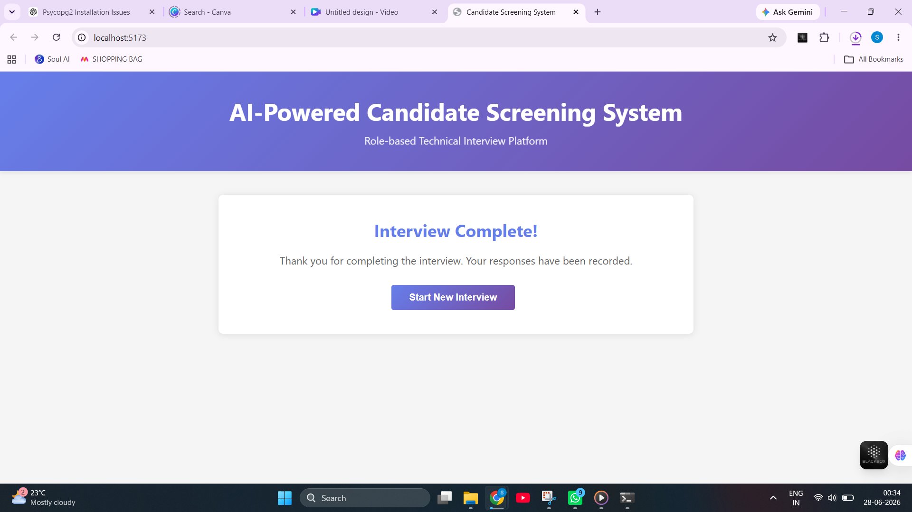
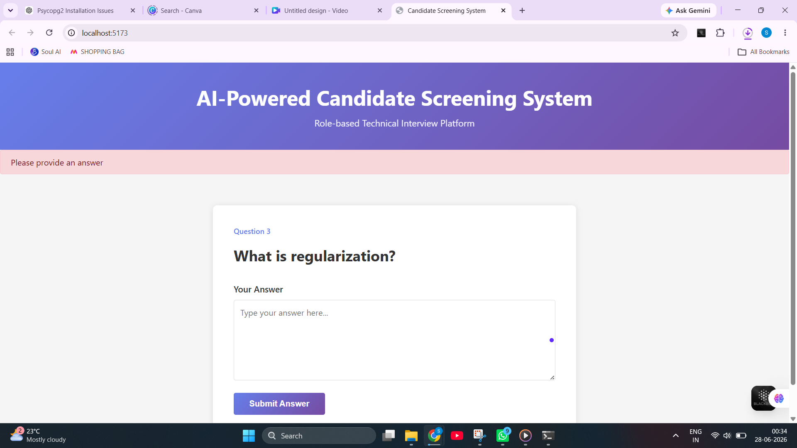

# AI-Powered Candidate Screening System

An intelligent AI-powered interview platform that automates candidate screening using Resume Parsing, Retrieval-Augmented Generation (RAG), and Large Language Models (LLMs).

The system analyzes a candidate's resume, retrieves role-specific knowledge, and dynamically generates personalized interview questions for different technical roles.

---

##  Features

-  Resume Upload (PDF/TXT)
-  AI Resume Parsing
-  Role-Based Interview Generation
  - Machine Learning Engineer
  - Data Scientist
  - Backend Engineer
-   Retrieval-Augmented Generation (RAG)
-   Dynamic AI Interview Questions
-   Interactive Interview Session
-   Candidate Answer Recording
-   Interview Session Management
-   JSON-Based Session Storage
-   FastAPI Backend
-   React Frontend

---

#  System Architecture

```
                Resume Upload
                      │
                      ▼
             Resume Parser
                      │
                      ▼
            Skills Extraction
                      │
                      ▼
             RAG Retrieval Engine
                      │
                      ▼
         Knowledge Base Retrieval
                      │
                      ▼
         OpenAI Question Generator
                      │
                      ▼
         Technical Interview Question
                      │
                      ▼
          Candidate Answer Submission
                      │
                      ▼
            Session Manager (JSON)
```

---

# Tech Stack

## Frontend

- React.js
- Axios
- HTML5
- CSS3
- JavaScript

## Backend

- FastAPI
- Python 3.13
- Pydantic
- Uvicorn

## AI & ML

- OpenAI GPT
- Sentence Transformers
- ChromaDB
- RAG (Retrieval-Augmented Generation)

## Storage

- JSON Session Storage
- Knowledge Base Files

---

#  Project Structure

```
AI-Candidate-Screening-System
│
├── backend
│   ├── app
│   │   ├── core
│   │   ├── models
│   │   ├── routes
│   │   ├── services
│   │   └── utils
│   │
│   ├── sessions
│   ├── vector_db
│   ├── requirements.txt
│   └── ingest_knowledge.py
│
├── frontend
│   ├── src
│   ├── public
│   ├── package.json
│   └── vite.config.js
│
├── knowledge_base
│   ├── backend-engineer.txt
│   ├── data-scientist.txt
│   └── ml-engineer.txt
│
├── README.md
└── .gitignore
```

---

#  Installation

## Clone Repository

```bash
git clone https://github.com/yourusername/interview-agent.git

cd AI-Candidate-Screening-System
```

---

## Backend Setup

```bash
cd backend

python -m venv venv
```

### Windows

```bash
venv\Scripts\activate
```

### Linux / Mac

```bash
source venv/bin/activate
```

Install dependencies

```bash
pip install -r requirements.txt
```

Create a `.env` file

```
OPENAI_API_KEY=your_openai_api_key
```

---

## Ingest Knowledge Base

```bash
python ingest_knowledge.py
```

---

## Start Backend

```bash
uvicorn app.main:app --reload
```

Backend runs on

```
http://localhost:8000
```

API Docs

```
http://localhost:8000/docs
```

---

## Frontend Setup

```bash
cd frontend

npm install

npm run dev
```

Frontend runs on

```
http://localhost:5173
```

---

#  Workflow

### Step 1

Select Target Role

- ML Engineer
- Backend Engineer
- Data Scientist

↓

### Step 2

Upload Resume

↓

### Step 3

Resume Parsing

↓

### Step 4

Knowledge Retrieval (RAG)

↓

### Step 5

Dynamic Question Generation

↓

### Step 6

Candidate Answers Questions

↓

### Step 7

Session Stored

↓

### Step 8

Interview Summary

---

# AI Pipeline

```
Resume
   │
   ▼
Resume Parser
   │
   ▼
Skill Extraction
   │
   ▼
Retrieve Knowledge
   │
   ▼
OpenAI GPT
   │
   ▼
Question Generation
   │
   ▼
Candidate Interview
```

---

# 📸 Screenshots

## Role Selection

_Add screenshot here_

---

## Resume Upload

_Add screenshot here_

---

## Interview Screen

_Add screenshot here_

---

## Session Summary

_Add screenshot here_

---

# Supported Roles

✔ Machine Learning Engineer

✔ Data Scientist

✔ Backend Engineer

---

# 📸 Screenshots

## Home Page


---

## Role Selection



---

## Resume Upload



---

## Interview - Question 1



---

## Interview - Question 2



---

## Completion Screen



---

## Error Handling


---

## 🎥 Demo Video

▶ **Watch the Demo:** (https://drive.google.com/file/d/1cK38AptRZQJd7tYEiL_RE6DQJpcRSYgU/view?usp=sharing)

------
# Author

**Silla Manoj Kumar**

Email: sillamanojsilla@gmail.com

LinkedIn: https://linkedin.com/in/silla-manoj-kumar-76829a249

GitHub: https://github.com/Manoj987654

---

#  If you like this project

Please give it a ⭐ on GitHub!

---
